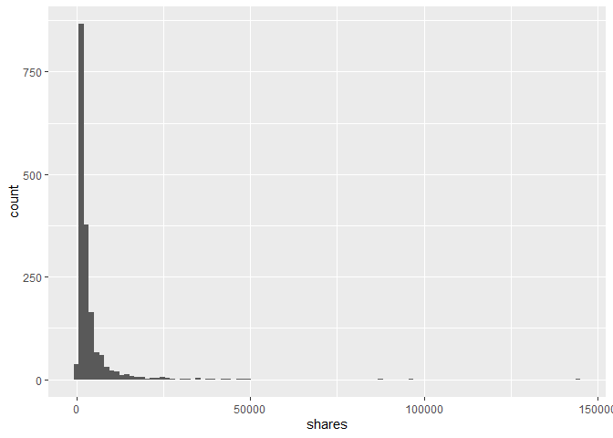

Saturday Analysis
================
Noel Hilliard
July 3, 2020

  - [Introduction Online News Popularity
    Data](#introduction-online-news-popularity-data)
  - [Saturday Data](#saturday-data)
  - [Summary Statistics](#summary-statistics)
      - [Histogram](#histogram)
      - [Bar Plot](#bar-plot)
      - [Numerical Summary](#numerical-summary)
  - [Modeling](#modeling)
      - [Ensemble Model: Bagged Tree](#ensemble-model-bagged-tree)
      - [Select Linear Regression
        Model](#select-linear-regression-model)

Project Objective: The goal is to create models for predicting the
`shares` variable from the dataset. You will create two models: a linear
regression model and a non-linear model (each of your choice). You will
use the parameter functionality of markdown to automatically generate an
analysis report for each `weekday_is_*` variable (so you’ll end up with
seven total outputted documents).

# Introduction Online News Popularity Data

The data used for this analysis was obtained from the [UCI Machine
Learning
Reposititory](https://archive.ics.uci.edu/ml/datasets/Online+News+Popularity).
The data set summarizes a set of features about articles published by
Mashable over a two year period. The purpose of this analysis is to
predict the number of shares in social networks using select features
from the data set. Two types of methods will be used to predict the
`shares`. The first model discussed is a bagged tree model. For this
analysis, the `shares` were divided into two groups (\< 1400 and \>=
1400) to create a binary classification problem. The second model
discussed is linear regression. Both types of models were trained/tuned
using the training data set and then then predictions were made using
the test data set.

The following libraries are loaded for the analysis.

``` r
library(ggplot2)
library(Hmisc)
library(rmarkdown)
library(tidyverse)
library(corrplot)
library(knitr)
library(caret)
```

# Saturday Data

The full data set contained data for all days of the week. This analysis
will focus on the data from saturday. Once the data was filtered for
saturday, the `shares` variable was divided into two groups: \< 1400 and
\>= 1400 in preparation for fitting the bagged tree model.

``` r
#read in data
newsData <-read_csv("S:/ST558/Homeworks/Project 2/ST558 Project 2/OnlineNewsPopularity.csv")
newsData$shares_group <- NA

#filter for day of week
weekdayData <- filter(newsData, newsData[[paste0("weekday_is_",params$day)]] == "1")


#split shares into 2 groups
for (i in 1:length(weekdayData$shares)){
  
  if(weekdayData$shares[i] < 1400){
    weekdayData$shares_group[i] <- "below 1400"
  }
  
  if(weekdayData$shares[i] >= 1400){
    weekdayData$shares_group[i] <- "above 1400"
  }
}

weekdayData$shares_group <- as.factor(weekdayData$shares_group)
```

The following variables were used in this analysis to predict the
`shares` variable:

  - `num_keywords` : Number of keywords in the metadata.
  - `avg_positive_polarity` : Average polarity of positive words.
  - `num_videos`: Number of videos.
  - `num_imgs`: Number of images.
  - `max_postive_polarity`: Maximum polarity of positive words.
  - `title_subjectivity`: Title subjectivity.
  - `rate_negative_words`: Rate of negative words among non-neutral
    tokens.
  - `n_unique_tokens`: Number of words in the title.
  - `average_token_length`: Average length of the words in the content.
  - `global_rate_positive_words`: Rate of positive words in the content.
  - `shares`: Number of shares.

The data frame below shows the subsetted data set with only the
variables of interest for this analysis.

``` r
weekdayData <- weekdayData %>% select(num_keywords, avg_positive_polarity, num_videos, num_imgs, 
           max_positive_polarity, title_subjectivity, rate_negative_words,
           n_unique_tokens, average_token_length, global_rate_positive_words, shares, shares_group)

head(weekdayData)
```

    ## # A tibble: 6 x 12
    ##   num_keywords avg_positive_po~ num_videos num_imgs max_positive_po~
    ##          <dbl>            <dbl>      <dbl>    <dbl>            <dbl>
    ## 1            5            0.309          0        1              0.6
    ## 2            6            0.317          0        1              1  
    ## 3            9            0.417          0       11              1  
    ## 4            7            0.417          0       21              1  
    ## 5           10            0.564          0        1              1  
    ## 6            9            0.331          0        1              1  
    ## # ... with 7 more variables: title_subjectivity <dbl>,
    ## #   rate_negative_words <dbl>, n_unique_tokens <dbl>,
    ## #   average_token_length <dbl>, global_rate_positive_words <dbl>, shares <dbl>,
    ## #   shares_group <fct>

The subsetted data set was randomly sampled using the `sample` function.
The training data set consists of 70% of the data and the testing data
set consists of 30% of the data. The `set.seed` function was used to
make the work reproducible.

``` r
#Create test/train data sets from filtered data set
set.seed(1)
train <- sample(1:nrow(weekdayData), size = nrow(weekdayData)*0.7)
test <- dplyr::setdiff(1:nrow(weekdayData), train)
weekdayDataTrain <- weekdayData[train, ]
weekdayDataTest <- weekdayData[test, ]
```

# Summary Statistics

This section covers some basic summary statistics about the variables in
the training data set.

## Histogram

The histogram below shows the distribution of `shares` using the
training data set. The majority of the number of shares are on the lower
end with some higher outliers. The `geom_histogram` function from the
`ggplot2` library was used to create the histogram.

``` r
g <- ggplot(weekdayDataTrain, aes(x = shares))
g + geom_histogram(bins = 100)
```

<!-- -->

## Bar Plot

The bar graph below shows the counts for the two groups of `shares`
using the training data set. The `geom_bar` function from the `ggplot2`
library was used to create the bar plot.

``` r
g <- ggplot(data = weekdayDataTrain, aes(x = shares_group))
g + geom_bar() + labs(x = "Shares Group", title = (paste0(capitalize(params$day)," Shares Groups")))
```

<!-- -->

## Numerical Summary

This is a numerical summary of the counts of shares in the two groups
using the training data set. The `table` function was used to create the
frequency table.

``` r
table(weekdayDataTrain$shares_group)
```

    ## 
    ## above 1400 below 1400 
    ##       1289        428

This is a summary of the `shares` variable in the training data set
which includes: minimum, 1st quartile, median, mean, 3rd quartile, and
maximum.

``` r
summary(weekdayDataTrain$shares)
```

    ##    Min. 1st Qu.  Median    Mean 3rd Qu.    Max. 
    ##      49    1400    2000    3806    3700  144400

The `TrainStatSum` function calculates a statistical summary for all the
variables of interest in the two `shares` groups.

``` r
TrainStatSum <- function(group){
  data <- weekdayDataTrain %>% filter(shares_group == group) %>% 
    select(num_keywords, avg_positive_polarity, num_videos, num_imgs, 
           max_positive_polarity, title_subjectivity, rate_negative_words,
           n_unique_tokens, average_token_length, global_rate_positive_words)
           kable(apply(data, 2, summary, col.names = c("num_keywords", 
           "avg_positive_polarity", "num_videos", "num_imgs", "max_positive_polarity", 
           "title_subjectivity", "rate_negative_words", "n_unique_tokens", "average_token_length",
           "global_rate_positive_words")))
}
```

The function is called for the `shares` above 1400.

``` r
TrainStatSum("above 1400")
```

|         | num\_keywords | avg\_positive\_polarity | num\_videos | num\_imgs | max\_positive\_polarity | title\_subjectivity | rate\_negative\_words | n\_unique\_tokens | average\_token\_length | global\_rate\_positive\_words |
| ------- | ------------: | ----------------------: | ----------: | --------: | ----------------------: | ------------------: | --------------------: | ----------------: | ---------------------: | ----------------------------: |
| Min.    |      1.000000 |               0.0000000 |     0.00000 |  0.000000 |               0.0000000 |           0.0000000 |             0.0000000 |         0.0000000 |               0.000000 |                     0.0000000 |
| 1st Qu. |      6.000000 |               0.3172840 |     0.00000 |  1.000000 |               0.6000000 |           0.0000000 |             0.1818182 |         0.4576613 |               4.470348 |                     0.0303894 |
| Median  |      8.000000 |               0.3693951 |     0.00000 |  1.000000 |               0.8000000 |           0.1666667 |             0.2698413 |         0.5203883 |               4.649372 |                     0.0411765 |
| Mean    |      7.660202 |               0.3598439 |     1.16602 |  5.425136 |               0.7837881 |           0.2849758 |             0.2770801 |         0.5143765 |               4.518488 |                     0.0416569 |
| 3rd Qu. |      9.000000 |               0.4171920 |     1.00000 |  8.000000 |               1.0000000 |           0.5000000 |             0.3666667 |         0.5961538 |               4.839962 |                     0.0533230 |
| Max.    |     10.000000 |               0.7606857 |    74.00000 | 99.000000 |               1.0000000 |           1.0000000 |             1.0000000 |         0.9574468 |               6.295393 |                     0.1306533 |

The function is called for the `shares` below 1400.

``` r
TrainStatSum("below 1400")
```

|         | num\_keywords | avg\_positive\_polarity | num\_videos | num\_imgs | max\_positive\_polarity | title\_subjectivity | rate\_negative\_words | n\_unique\_tokens | average\_token\_length | global\_rate\_positive\_words |
| ------- | ------------: | ----------------------: | ----------: | --------: | ----------------------: | ------------------: | --------------------: | ----------------: | ---------------------: | ----------------------------: |
| Min.    |      1.000000 |               0.0000000 |     0.00000 |  0.000000 |               0.0000000 |           0.0000000 |             0.0000000 |         0.0000000 |               0.000000 |                     0.0000000 |
| 1st Qu. |      6.000000 |               0.3011601 |     0.00000 |  1.000000 |               0.5875000 |           0.0000000 |             0.1921031 |         0.4625211 |               4.501708 |                     0.0226197 |
| Median  |      7.000000 |               0.3575392 |     0.00000 |  1.000000 |               0.8000000 |           0.2500000 |             0.2857143 |         0.5160851 |               4.700284 |                     0.0367873 |
| Mean    |      7.205608 |               0.3471029 |     1.14486 |  5.369159 |               0.7583723 |           0.2977078 |             0.3015940 |         0.5015568 |               4.473845 |                     0.0375569 |
| 3rd Qu. |      9.000000 |               0.4145396 |     1.00000 |  9.000000 |               1.0000000 |           0.5000000 |             0.4117647 |         0.5816600 |               4.907377 |                     0.0512205 |
| Max.    |     10.000000 |               1.0000000 |    27.00000 | 56.000000 |               1.0000000 |           1.0000000 |             0.7333333 |         0.8709677 |               5.956897 |                     0.1200000 |

# Modeling

This section will fit two types of models to predict the `shares`
variable.The first section discusses an ensemble model and the second
section discusses the selection of a linear regression model from a
collection of linear regression models. The training data set was used
to fit the two models and the test data set was used to make
predictions.

## Ensemble Model: Bagged Tree

The `caret` package was used to fit the bagged tree model. Repeated
cross validation was used in the `trainControl` function. This result
was fed into the `train` function with the method specified as `treebag`
for a bagged tree model to train the tree on the sample. The predictors
were centered and scaled in the `preProcess` argument. This method does
not have any tuning parameters. The best model fit is shown below.

``` r
set.seed(1)
trCtrl <- trainControl(method = "repeatedcv", number = 10, repeats = 3)

bag_fit <- train(shares_group ~ num_keywords + avg_positive_polarity + num_videos + num_imgs, 
                 data = weekdayDataTrain, method = "treebag", trControl = trCtrl, 
                 preProcess = c("center", "scale"), na.action = na.pass)

bag_fit
```

    ## Bagged CART 
    ## 
    ## 1717 samples
    ##    4 predictor
    ##    2 classes: 'above 1400', 'below 1400' 
    ## 
    ## Pre-processing: centered (4), scaled (4) 
    ## Resampling: Cross-Validated (10 fold, repeated 3 times) 
    ## Summary of sample sizes: 1546, 1546, 1545, 1545, 1545, 1545, ... 
    ## Resampling results:
    ## 
    ##   Accuracy   Kappa     
    ##   0.7002686  0.08412885

The best bagged tree model fit was used to predict the `shares` groups
using the test data set. The top of the bagged tree model prediction is
shown below.

``` r
bag_pred <- predict(bag_fit, newdata = weekdayDataTest)

head(bag_pred)
```

    ## [1] above 1400 above 1400 above 1400 above 1400 above 1400 above 1400
    ## Levels: above 1400 below 1400

A data frame of the prediction based on the test data set and the test
data set are shown below.

``` r
bag_fitInfo <- tbl_df(data.frame(bag_pred, weekdayDataTest$shares_group, weekdayDataTest$num_keywords, 
                                weekdayDataTest$avg_positive_polarity,
                                 weekdayDataTest$num_videos, weekdayDataTest$num_imgs))

bag_fitInfo
```

    ## # A tibble: 736 x 6
    ##    bag_pred weekdayDataTest~ weekdayDataTest~ weekdayDataTest~ weekdayDataTest~
    ##    <fct>    <fct>                       <dbl>            <dbl>            <dbl>
    ##  1 above 1~ above 1400                      6            0.317                0
    ##  2 above 1~ above 1400                      7            0.417                0
    ##  3 above 1~ above 1400                      9            0.331                0
    ##  4 above 1~ above 1400                      9            0.434                0
    ##  5 above 1~ above 1400                      8            0.432                1
    ##  6 above 1~ below 1400                      7            0.374                0
    ##  7 above 1~ above 1400                     10            0.269                0
    ##  8 above 1~ above 1400                      9            0.387                0
    ##  9 above 1~ above 1400                      8            0.331                1
    ## 10 above 1~ above 1400                     10            0.378               11
    ## # ... with 726 more rows, and 1 more variable: weekdayDataTest.num_imgs <dbl>

A frequency table of the bagged tree prediction and the `shares_group`
column from the test data set are shown below. This table will be used
to calculate the misclassification rate. The `table` function was used
to create the frequency table.

``` r
bag_tbl <- table(bag_fitInfo$bag_pred, bag_fitInfo$weekdayDataTest.shares_group)

bag_tbl
```

    ##             
    ##              above 1400 below 1400
    ##   above 1400        471        165
    ##   below 1400         68         32

A confusion matrix is below to measure model accuracy for the test data.
The model is considered useful if the accuracy (1-misClass) is greater
than the no information rate.

``` r
confusionMatrix(bag_pred, weekdayDataTest$shares_group)
```

    ## Confusion Matrix and Statistics
    ## 
    ##             Reference
    ## Prediction   above 1400 below 1400
    ##   above 1400        471        165
    ##   below 1400         68         32
    ##                                           
    ##                Accuracy : 0.6834          
    ##                  95% CI : (0.6485, 0.7169)
    ##     No Information Rate : 0.7323          
    ##     P-Value [Acc > NIR] : 0.9986          
    ##                                           
    ##                   Kappa : 0.043           
    ##                                           
    ##  Mcnemar's Test P-Value : 3.192e-10       
    ##                                           
    ##             Sensitivity : 0.8738          
    ##             Specificity : 0.1624          
    ##          Pos Pred Value : 0.7406          
    ##          Neg Pred Value : 0.3200          
    ##              Prevalence : 0.7323          
    ##          Detection Rate : 0.6399          
    ##    Detection Prevalence : 0.8641          
    ##       Balanced Accuracy : 0.5181          
    ##                                           
    ##        'Positive' Class : above 1400      
    ## 

The misclassification rate for the bagged tree model is shown below. A
lower misclassification rate demonstrates better accuracy in
predictions.

``` r
bag_misClass <- 1 - sum(diag(bag_tbl))/sum(bag_tbl)

bag_misClass
```

    ## [1] 0.3165761

## Select Linear Regression Model

This section will discuss methods for selecting a linear regression
model from a collection of linear regression models. Correlations of
numeric predictor variables with each other and with the response
variable `shares` were used to create the collection of variables.
Predictor variables with lower correlations with each other and the
`shares` variable were used because higher correlations may interfere
with model performance.

The figure below shows a correlation plot of the correlations between a
subset of predictor variables from the full data set that were in the
training data set. The `cor` function was used from the `corrplot`
library.

``` r
correlation <- cor(weekdayDataTrain %>% select(num_keywords, avg_positive_polarity, num_videos, num_imgs, 
           max_positive_polarity, title_subjectivity, rate_negative_words,
           n_unique_tokens, average_token_length, global_rate_positive_words, shares), method = "spearman")

corrplot(correlation, type = "upper", tl.pos = "lt")
corrplot(correlation, type = "lower", method = "number", add = TRUE, tl.pos = "n")
```

<!-- -->

Linear regression models can be formed based on the predictor variables
with lower correlations. In this example, two simple linear regression
models and three multiple linear regression models were selected based
on variables with lower correlations. The `lm` function was used to fit
the models with the training data set.

``` r
mlrFit1 <- lm(shares ~ num_keywords + num_imgs, data = weekdayDataTrain)

mlrFit2 <- lm(shares ~ num_keywords, 
              data = weekdayDataTrain)

mlrFit3 <- lm(shares ~ num_imgs + num_videos + global_rate_positive_words,
              data = weekdayDataTrain)

mlrFit4 <- lm(shares ~ n_unique_tokens + max_positive_polarity, data = weekdayDataTrain)

mlrFit5 <- lm(shares ~ global_rate_positive_words, weekdayDataTrain)
```

To select the best linear regression model, adjusted R square, AIC, and
BIC values for each model fit are used to determine which model predicts
the `shares` value the best.

``` r
library(MuMIn)

compareFitStats <- function(mlrFit1, mlrFit2, mlrFit3, mlrFit4, mlrFit5){
  fitStats <- data.frame(fitStat = c("Adj R Square", "AIC", "BIC"),
  Fit1 = c(round(summary(mlrFit1)$adj.r.squared, 5), AIC(mlrFit1),
                 BIC(mlrFit1)),
  Fit2 = c(round(summary(mlrFit2)$adj.r.squared, 5), AIC(mlrFit2),
                 BIC(mlrFit2)),
  Fit3 = c(round(summary(mlrFit3)$adj.r.squared, 5), AIC(mlrFit3),
                BIC(mlrFit3)),
  Fit4 = c(round(summary(mlrFit4)$adj.r.squared, 5), AIC(mlrFit4),
                BIC(mlrFit4)),
  Fit5 = c(round(summary(mlrFit5)$adj.r.squared, 5), AIC(mlrFit5),
                BIC(mlrFit5)))
  
  #put names in data frame
  calls <- as.list(match.call())
  calls[[1]] <- NULL
  names(fitStats[2:6]) <- unlist(calls)
  fitStats
}
```

The table below shows the adjusted R square, AIC, and BIC for each model
fit. Larger adjusted R square values and smaller AIC and BIC values are
better.

``` r
fitStats <- compareFitStats(mlrFit1, mlrFit2, mlrFit3, mlrFit4, mlrFit5)

fitStats
```

    ##        fitStat        Fit1        Fit2        Fit3        Fit4        Fit5
    ## 1 Adj R Square     0.00146     0.00182    -0.00052     0.00048     0.00003
    ## 2          AIC 35156.06094 35154.45696 35160.47199 35157.74372 35157.52560
    ## 3          BIC 35177.85428 35170.80196 35187.71366 35179.53706 35173.87060

For this example the first linear regression model was selected to
demonstrate predicting with test data and calculating the root mean
square error (RMSE). RMSE for the testing data set is also used to
select the best model. The `predict` function was used to make a
prediction and the `RMSE` function was used to calculate the RMSE.

``` r
mlrFit1_predTest <- predict(mlrFit1, newdata = weekdayDataTest)

head(mlrFit1_predTest)
```

    ##        1        2        3        4        5        6 
    ## 3498.795 3895.414 3995.538 3983.986 4049.443 3664.376

``` r
RMSE(weekdayDataTest$shares, mlrFit1_predTest)
```

    ## [1] 23842.01
